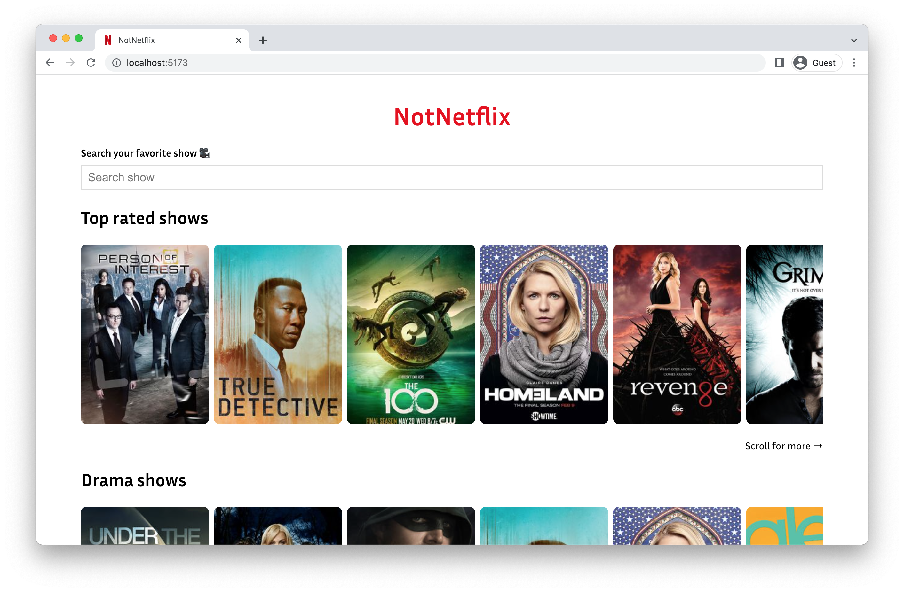

# NotNetflix

This is a movie streaming app similar to Netflix, but definitely not Netflix.




## Project setup
```sh
# Make sure you are on Node version 18
node -v

# Run the local test environment
npm install
npm run dev

# Run the unit tests
npm run test:unit
```

## Design choices

- This project is made with Vue 3. I had no experience with Vue 3, but as I heard it's being used in a few projects at ABN Amro I thought it would be fun to explore the framework a bit.

- There is very simple state management in the `src/services/store.js` - but it doesn't use any external dependencies. For this small project that seemed a bit overkill.

- I used plain CSS instead of a fancier version such as Sass or PostCSS because for this small project using the simple plain css rules is sufficient.
    - There are some global styles in `src/assets/main.css`. The rest is scoped CSS in the Vue component files.


